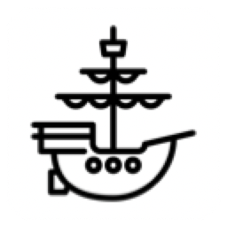
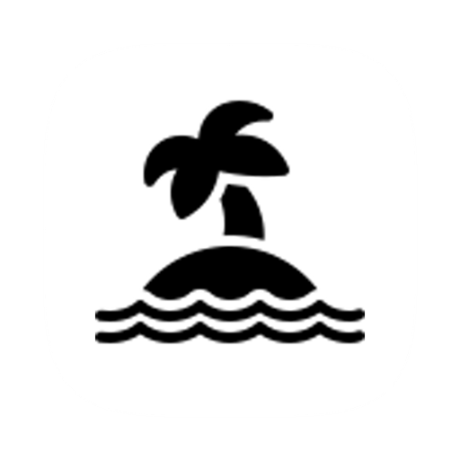

# Ferry + Island

<p align="center">
  
  
</p>

<p align="center">
  <strong>Ferry</strong> is the browser UI.<br />
  <strong>Island</strong> is the local desktop engine.
</p>

<p align="center">
  
  
  
  
  
  
</p>

Ferry + Island is a local-first YouTube download workflow:

- Ferry injects a download UI directly into YouTube.
- Island runs on your machine and does the real download work.
- Downloads stay local.
- There is no cloud backend, no login, and no telemetry path in the product.

## Product Map

| Part | Role | What you see |
|---|---|---|
| Ferry | Browser extension | YouTube button, inline panel, popup, settings |
| Island | Desktop app | Tray app, local API, downloads engine |
| Bundled sidecars | Media tools | `yt-dlp`, `ffmpeg`, `ffprobe` used by Island |

## What Works

| Area | Status | Notes |
|---|---|---|
| Inline YouTube panel | Working | Main GUI flow |
| Popup activity view | Working | Recent jobs, progress, reveal, cancel |
| Desktop settings window | Working | Download folder and local app controls |
| Video downloads | Working | Current presets: `360p`, `720p`, `1080p`, `1440p`, `2160p` |
| Audio downloads | Working | Top `3` audio qualities only |
| Thumbnail downloads | Working | Top `2` thumbnail sizes only |
| Clip range | Working | Controlled from the YouTube page player |
| Live progress | Working | WebSocket from Island to Ferry |
| GitHub desktop builds | Working | macOS, Windows, Linux release matrix |

## How It Feels

```text
YouTube page
   ↓
Ferry button + inline panel
   ↓
Choose video / audio / thumbnail
   ↓
Island local API on 127.0.0.1:49152
   ↓
Bundled yt-dlp + ffmpeg + ffprobe
   ↓
File saved locally
```

## GUI Flow

### 1. Open a YouTube video
- Ferry injects its button into the watch page.

### 2. Open the Ferry panel
- Choose:
  - video
  - audio
  - thumbnail

### 3. Pick a quality
- Ferry shows a reduced, cleaner preset list instead of a huge raw format dump.

### 4. Download
- Island receives the job.
- Ferry shows progress live in the page and popup.

## Download Options

### Video
- `360p`
- `720p`
- `1080p`
- `1440p`
- `2160p`

### Audio
- top `3` audio qualities only

### Thumbnail
- top `2` thumbnail sizes only

Note:
- thumbnail URLs stay internal to Island
- the extension does not receive raw thumbnail source links

## Direct Downloads

<p>
  
  
  
</p>

GitHub Releases publish:

- `Island-macOS-app.zip`
- `Island-windows-setup.exe`
- `Island-linux.AppImage`
- `Island-linux.deb`

Important:
- macOS builds are convenient direct-download builds
- they are not notarized yet
- Gatekeeper may still warn on first open

If an older macOS build is quarantined:

```bash
xattr -cr /Applications/Island.app
```

## Quick Start

### Browser

<p>
  
  
  
</p>

### Option A: Use release builds

1. Download the Island desktop app from GitHub Releases.
2. Install or unzip it.
3. Launch Island.
4. Load the `extension/` folder as an unpacked extension.
5. Open a YouTube watch page.

### Option B: Run locally from source

#### macOS

```bash
./scripts/bootstrap-macos.sh
```

#### Linux

```bash
./scripts/bootstrap-linux.sh
```

#### Windows PowerShell

```powershell
powershell -ExecutionPolicy Bypass -File .\scripts\bootstrap-windows.ps1
```

These scripts:

- install platform prerequisites
- install Rust
- install Tauri CLI
- hydrate bundled sidecars where needed
- run `cargo check`

## Run From Source

### Start Island

```bash
cd app/src-tauri
cargo run
```

Expected log:

```text
INFO island_desktop::server: Island API listening on http://127.0.0.1:49152
```

### Load Ferry

1. Open `chrome://extensions`
2. Enable `Developer mode`
3. Click `Load unpacked`
4. Select [`extension/`](./extension)
5. Refresh any YouTube tabs

## Repository Layout

```text
.
├── extension/            Ferry browser extension
├── app/src-tauri/        Island desktop backend + Tauri config
├── app/src/              Island webview pages
├── scripts/              bootstrap, build, and smoke helpers
├── docs/                 supporting technical docs
└── README.md
```

## Main Files

### Extension
- [manifest.json](./extension/manifest.json)
- [content.js](./extension/content.js)
- [content.css](./extension/content.css)
- [background.js](./extension/background.js)
- [popup.js](./extension/popup.js)
- [settings.js](./extension/settings.js)

### Desktop app
- [main.rs](./app/src-tauri/src/main.rs)
- [server.rs](./app/src-tauri/src/server.rs)
- [queue.rs](./app/src-tauri/src/queue.rs)
- [downloader.rs](./app/src-tauri/src/downloader.rs)
- [formats.rs](./app/src-tauri/src/formats.rs)
- [tauri.conf.json](./app/src-tauri/tauri.conf.json)

## Local API

| Endpoint | Method | Purpose |
|---|---|---|
| `/health` | GET | Check whether Island is reachable |
| `/formats` | POST | Fetch reduced format presets |
| `/download` | POST | Queue a download |
| `/status/{job_id}` | GET | Poll job state |
| `/reveal` | POST | Reveal a file or folder |
| `/jobs/{job_id}/cancel` | POST | Cancel a job |
| `/jobs/{job_id}/skip` | POST | Skip a queued job |
| `/action/open-settings` | POST | Open Island settings |
| `/action/open-downloads` | POST | Open downloads folder |
| `/ws` | GET | Progress WebSocket |

## Development

### Checks

```bash
./scripts/dev-check.sh
```

This runs:

- `cargo check`
- `cargo clippy -- -D warnings`
- `cargo fmt --check`
- `node --check` on extension files

### Smoke test

With Island running:

```bash
node scripts/smoke-api.mjs
```

Queue a test job:

```bash
node scripts/smoke-api.mjs --queue
```

### Local build helper

```bash
./scripts/build-all.sh
```

## Platform Notes

- Chromium is the main browser path right now.
- Firefox and Safari are not first-class release targets in this repo yet.
- Linux now ships through CI, but distro differences still make it the least uniform desktop target.
- macOS still needs proper signing/notarization for the smoothest public install flow.

See the platform audit:

- [platform-audit.md](./docs/platform-audit.md)

## Troubleshooting

| Problem | Check |
|---|---|
| Ferry button missing | Reload the extension and refresh YouTube |
| Popup says Island is offline | Make sure Island is running on `127.0.0.1:49152` |
| Download stuck | Check Island terminal logs first |
| Old UI still showing | Reload the extension and refresh all YouTube tabs |
| Fewer qualities than expected | Ferry intentionally shows a reduced preset list |

## License

MIT — see [LICENSE](./LICENSE)
