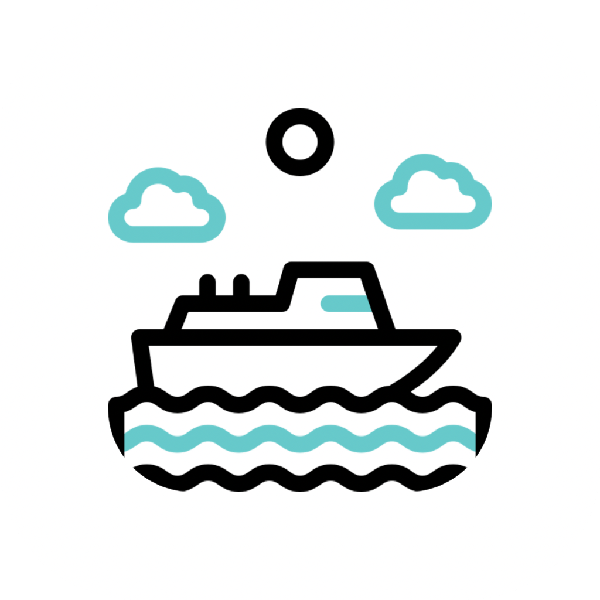

# Ferry + Island

<p align="center">
  
</p>

<p align="center">
  <strong>Ferry</strong> is the browser-side YouTube download experience.<br />
  <strong>Island</strong> is the local desktop engine that does the actual download work.
</p>

<p align="center">
  
  
  
  
  
  
  
</p>

Ferry + Island is a local-first download workflow for YouTube:

- **Ferry** injects a download UI into YouTube pages and gives you a compact extension popup/settings experience.
- **Island** runs locally on your machine, exposes a localhost API, and uses bundled media tools to download, merge, remux, and track progress.
- **No cloud backend, no account system, no telemetry.**

## Current Status

| Area | Status | Notes |
|---|---|---|
| Desktop companion | Working | Tauri tray app with local API and settings window |
| YouTube inline UI | Working | Ferry injects directly into YouTube watch pages |
| Popup + settings page | Working | Popup shows activity, settings open in a dedicated extension page |
| Video downloads | Working | Current surfaced presets are `360p`, `720p`, `1080p`, `1440p`, `2160p` if available |
| Audio downloads | Working | Current surfaced presets are top `3` audio qualities |
| Thumbnail downloads | Working | Current surfaced presets are top `2` thumbnail sizes |
| Clip / time range | Working | Time range selection is handled from the page player |
| Live progress | Working | Island streams progress over WebSocket to Ferry |
| Sidecar tools | Working | Bundled `yt-dlp`, `ffmpeg`, and `ffprobe` are used by Island |
| Browser support today | Best on Chromium | Current extension is Manifest V3 and loads cleanly in Chromium-based browsers |
| Firefox / Safari | Not first-class yet | Not packaged or documented here as a supported release path yet |

## What This Repo Gives You

- Download button injected into the YouTube action area
- Inline panel for **video**, **audio**, and **thumbnail** downloads
- Clip-range selection for video and audio
- Local queue-based downloader
- Live progress, completion, and error feedback
- Activity history in the popup
- Dedicated extension settings page
- Tray-based desktop companion with local-only API

## Architecture

```text
┌─────────────────────────────────────────────────────────────┐
│                        BROWSER                              │
│                                                             │
│   YouTube Watch Page                                        │
│   ┌─────────────────────────────────────────────────────┐  │
│   │  [Like] [Share] [Ferry]  ← injected UI             │  │
│   └─────────────────────────────────────────────────────┘  │
│                          │                                  │
│                Ferry inline panel / popup                   │
│                          │                                  │
│           localhost HTTP + WebSocket messages               │
└──────────────────────────┼──────────────────────────────────┘
                           │
                    127.0.0.1:49152
                           │
┌──────────────────────────▼──────────────────────────────────┐
│                    ISLAND DESKTOP APP                        │
│                                                             │
│   Axum API  →  Queue  →  yt-dlp / ffmpeg / ffprobe         │
│                                                             │
│                 Downloaded file saved locally               │
└─────────────────────────────────────────────────────────────┘
```

## Repository Layout

```text
.
├── extension/                 # Ferry browser extension
│   ├── manifest.json
│   ├── content.js             # injected YouTube UI
│   ├── content.css
│   ├── background.js          # service worker, WS, activity, notifications
│   ├── popup.html/css/js      # toolbar popup
│   ├── settings.html/css/js   # extension settings page
│   ├── api.js
│   ├── constants.js
│   └── runtime.js
├── app/
│   ├── src/                   # Tauri webview pages
│   └── src-tauri/
│       ├── resources/         # sidecar binaries
│       ├── src/
│       │   ├── main.rs
│       │   ├── server.rs
│       │   ├── queue.rs
│       │   ├── downloader.rs
│       │   ├── formats.rs
│       │   ├── models.rs
│       │   ├── config.rs
│       │   └── error.rs
│       └── tauri.conf.json
├── docs/
├── scripts/
└── README.md
```

## Download Flow

1. Open a YouTube watch page.
2. Ferry injects its inline UI and starts preparing format data.
3. You choose a mode:
   - video
   - audio
   - thumbnail
4. Ferry sends the download request to Island over `http://127.0.0.1:49152`.
5. Island queues the job and runs the bundled downloader sidecars.
6. Progress is streamed back to Ferry over WebSocket.
7. The file is saved locally and can be revealed from the popup/activity UI.

## Setup

## GitHub Downloads

For macOS downloads directly from GitHub:

- every push to `main` runs the macOS desktop workflow and uploads downloadable workflow artifacts
- every pushed tag matching `v*` publishes macOS release assets to GitHub Releases

Current macOS outputs:

- `Island.app` packaged as `Island-macOS-app.zip`

Note:

- these builds are for direct download convenience
- they are not code-signed or notarized yet, so macOS may warn that the app is from an unidentified developer
- releases published before the ad-hoc bundle-signing fix may show a misleading `"Island" is damaged and can't be opened` dialog because the zipped `.app` bundle was not sealed correctly before upload
- if that happens on an older build, download the latest release artifact after the workflow reruns, or remove the quarantine flag manually:

```bash
xattr -cr /Applications/Island.app
```

### Desktop requirements

<p>
  
  
  
</p>

### Browser requirements

<p>
  
  
  
</p>

### Option A: bootstrap in one command

#### macOS

```bash
./scripts/bootstrap-macos.sh
```

#### Linux

```bash
./scripts/bootstrap-linux.sh
```

#### Windows PowerShell

```powershell
powershell -ExecutionPolicy Bypass -File .\scripts\bootstrap-windows.ps1
```

These scripts install the Rust toolchain, Node.js, media dependencies, and verify the backend build.

### Option B: run manually

#### 1. Start Island

```bash
cd app/src-tauri
cargo run
```

Expected startup log:

```text
INFO island_desktop::server: Island API listening on http://127.0.0.1:49152
```

#### 2. Load Ferry

1. Open `chrome://extensions`
2. Enable **Developer mode**
3. Click **Load unpacked**
4. Select the [`extension/`](./extension) folder
5. Open a YouTube watch page

## Using Ferry

### Inline panel

The primary experience is the injected Ferry panel on YouTube watch pages.

You can:

- choose video quality
- choose MP3 bitrate
- choose thumbnail size
- set a clip range for video/audio
- trigger a download without leaving the page

### Popup

The toolbar popup is a companion surface for:

- recent transfers
- job progress
- reveal / cancel / skip actions
- opening the extension settings page

### Extension settings page

The Ferry settings page currently includes:

- theme mode controls
- Island connection status
- quick actions like opening downloads or Island settings

## Current Format Surface

Ferry currently limits the surfaced quality list intentionally:

### Video

- `360p`
- `720p`
- `1080p`
- `1440p`
- `2160p`

Only the heights actually available for a given video are returned.

### Audio

- top `3` highest qualities only

### Thumbnail

- top `2` highest sizes only

Thumbnail URLs are kept internal to Island and are not exposed as raw links in the extension-facing format payload.

## Local API

| Endpoint | Method | Purpose |
|---|---|---|
| `/health` | GET | Check whether Island is reachable |
| `/formats` | POST | Fetch the current limited format set for a YouTube URL |
| `/download` | POST | Queue a new download |
| `/status/{job_id}` | GET | Poll job status |
| `/reveal` | POST | Reveal a saved file/folder |
| `/jobs/{job_id}/cancel` | POST | Cancel a queued or active job |
| `/jobs/{job_id}/skip` | POST | Skip a queued job |
| `/action/open-settings` | POST | Open Island settings |
| `/action/open-downloads` | POST | Open the downloads folder |
| `/ws` | GET / ANY | WebSocket progress stream |

## Development

### Validation

Run the dev checks:

```bash
./scripts/dev-check.sh
```

This covers:

- `cargo check`
- `cargo clippy -- -D warnings`
- `cargo fmt --check`
- `node --check` on extension scripts

### API smoke test

With Island running:

```bash
node scripts/smoke-api.mjs
```

Or queue a test download:

```bash
node scripts/smoke-api.mjs --queue
```

### Full build helper

```bash
./scripts/build-all.sh
```

## Troubleshooting

| Problem | What to check |
|---|---|
| Ferry button is missing on YouTube | Reload the extension, then refresh the YouTube tab |
| Popup says Island is offline | Make sure `cargo run` is active in [`app/src-tauri`](./app/src-tauri) |
| Downloads do not start | Check Island logs in the terminal first |
| Extension changed but YouTube still shows old UI | Reload the extension and refresh all YouTube tabs |
| Port `49152` is already in use | Stop the existing process using that port |
| You get fewer qualities than expected | Ferry currently surfaces a reduced list by design |

## Current Constraints

This repo is in an active product-building phase, so a few things are intentionally still in-progress:

- format probing is still yt-dlp based and can be slow on some videos
- Firefox and Safari are not documented as first-class release targets here yet
- YouTube is the only supported platform in the current code path
- no backend format cache is documented as part of the public setup flow yet

## Why Ferry + Island Exists

This project is not trying to be a cloud service or a download website clone.

It is trying to make this feel native:

- browser-first
- local-first
- private by default
- no terminal for normal usage

## License

MIT — see [LICENSE](./LICENSE)
